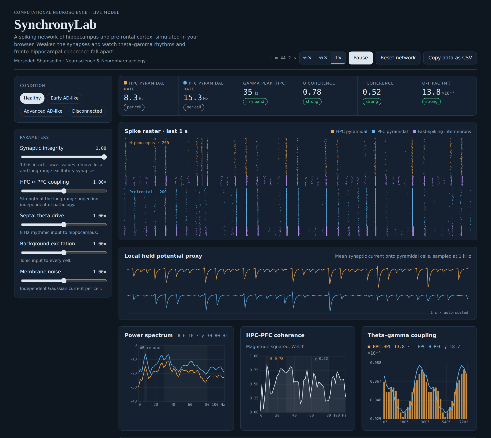
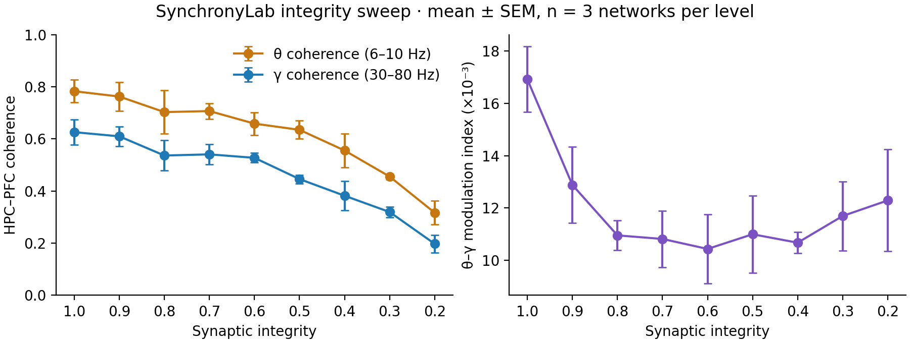

# SynchronyLab

**A live spiking-network model of hippocampal–prefrontal oscillations, coherence and theta–gamma coupling under progressive synaptic loss.**

[](https://mersedeshamsedinqu-cell.github.io/SynchronyLab/)
[](https://github.com/mersedeshamsedinqu-cell/SynchronyLab/actions/workflows/ci.yml)
[](LICENSE)




SynchronyLab simulates **400 Izhikevich neurons** in two coupled regions, hippocampus (HPC) and prefrontal cortex (PFC), in real time in the browser. It computes the same measures used in rodent electrophysiology as the network runs:

- spike rasters and an LFP proxy for each region
- Welch power spectra, with emergent **PING gamma (~35 Hz)** and septally paced **theta (8 Hz)**
- **HPC–PFC magnitude-squared coherence**
- **theta–gamma phase–amplitude coupling** (Tort modulation index), within HPC and from HPC θ to PFC γ
- a built-in **synaptic-integrity sweep**: 27 independent simulations, mean ± SEM

A single slider, *synaptic integrity*, stands in for Alzheimer's-like pathology: loss of local and long-range excitatory synapses together with fast-spiking interneuron dysfunction. Move it and watch long-range synchrony break down.

## Why

In rodent models of Alzheimer's disease, behavioural recovery and recovery of network synchrony can come apart. For example, spatial memory can be restored while fronto-hippocampal synchrony is not ([Shamsedin, 2026, *Neuroscience Research* 231:105117](https://doi.org/10.1016/j.neures.2026.105117)). SynchronyLab is a small, transparent sandbox for asking *which circuit changes are enough to disrupt synchrony*, and for teaching the analysis pipeline behind these results.

## Quick start

**Browser.** Open the [live demo](https://mersedeshamsedinqu-cell.github.io/SynchronyLab/), or open `index.html` locally. It is a single file with no build step and no dependencies.

**Python (reproducible figures).**

```bash
pip install -r requirements.txt
python python/run_sweep.py --seeds 5 --duration 8 --out docs/sweep.png
pytest -q
```

```python
from python.synchronylab import Network, Params, analyse
out = Network(Params(integrity=0.4), seed=1).run(8000)   # 8 s
r = analyse(out["lfp_h"], out["lfp_f"])
print(r["theta_coherence"], r["gamma_coherence"], r["pac_mi_hpc"])
```

## Example result



HPC–PFC coherence falls steadily with synapse loss in both the theta and gamma bands (n = 3 networks per level, 8 s each; raw values in [`docs/sweep.csv`](docs/sweep.csv)). Local theta–gamma coupling drops sharply at the first loss of integrity and then levels off, so **local** and **long-range** measures degrade differently in this model.

## Model

| Component | Choice |
|---|---|
| Neurons | Izhikevich (2003): 160 regular-spiking pyramidal cells and 40 fast-spiking interneurons per region; heterogeneous `c`, `d`, gains |
| Integration | Euler, dt = 0.5 ms (two half-steps for *v*) |
| Synapses | Pooled exponential traces, τ<sub>E</sub> = 2 ms, τ<sub>I</sub> = 5 ms |
| Rhythms | 8 Hz septal drive to HPC; gamma emerges from E–I interaction (PING) |
| Long range | HPC→PFC 5.3× stronger than PFC→HPC |
| Integrity *q* | scales E→E (×*q*), E→I (×(0.35 + 0.65*q*)) and long-range weights (×*q*·coupling) |
| LFP proxy | Mean synaptic current onto pyramidal cells, 1 kHz |
| Spectra | Welch, 512-sample Hann, 50 % overlap |
| PAC | Tort et al. (2010) MI, 18 bins; θ 6–10 Hz, γ 30–80 Hz; FFT band-pass + Hilbert |

## Repository layout

```
index.html              browser app (simulation + analysis + UI, no dependencies)
python/synchronylab.py  NumPy/SciPy reference implementation
python/run_sweep.py     reproduces the integrity sweep figure and CSV
tests/                  pytest suite (firing rates, gamma, PAC detector, coherence loss)
docs/                   figures and data
```

## Limitations

This is a phenomenological model for teaching and hypothesis generation. It is **not** fitted to recordings, the LFP is a current-based proxy, and synapses are pooled (mean-field) rather than cell-to-cell. Treat the numbers as qualitative.

## Roadmap

- [ ] Fit parameters to open LFP datasets (e.g. CRCNS hc-3)
- [ ] Granger causality and phase-locking value
- [ ] Web Worker for larger networks
- [ ] Parameter-sensitivity analysis

Contributions and issues are welcome.

## Cite

If you use SynchronyLab, please cite it with the metadata in [`CITATION.cff`](CITATION.cff) (GitHub shows a **Cite this repository** button).

## References

- Izhikevich, E. M. (2003). Simple model of spiking neurons. *IEEE Trans. Neural Netw.* 14(6), 1569–1572.
- Tort, A. B. L., Komorowski, R., Eichenbaum, H., & Kopell, N. (2010). Measuring phase-amplitude coupling between neuronal oscillations of different frequencies. *J. Neurophysiol.* 104(2), 1195–1210.
- Shamsedin, M. (2026). *Neuroscience Research*, 231, 105117. https://doi.org/10.1016/j.neures.2026.105117

---

**Author:** Mersedeh Shamsedin · [ORCID 0009-0001-2586-1937](https://orcid.org/0009-0001-2586-1937) · [LinkedIn](https://linkedin.com/in/mersedeh-shamsedin)
